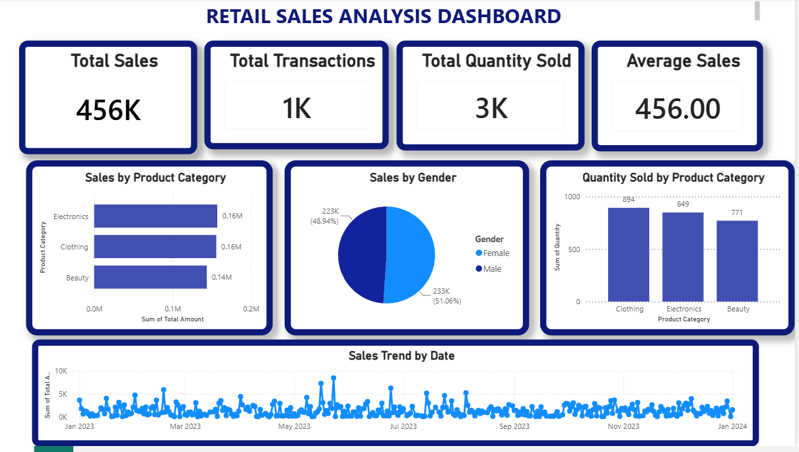

# Week 2 – Advanced Excel Analysis + Power BI Dashboard

## Project Overview

As part of Week 2 of my Data Analysis Internship at LogicStack, I enhanced my Excel analysis skills and learned how to build an interactive business dashboard using Microsoft Power BI.

This project focused on converting raw retail sales data into meaningful business insights through Pivot Tables, KPI calculations, and data visualization.

---

## Objectives

- Perform advanced data analysis using Pivot Tables
- Calculate Key Performance Indicators (KPIs)
- Generate business-focused insights
- Learn Power BI dashboard development
- Create an interactive sales dashboard
- Improve business decision-making through visualization

---

## Dataset Information

The dataset contains retail sales transaction records including:

- Transaction ID
- Date
- Customer ID
- Gender
- Age
- Product Category
- Quantity
- Price per Unit
- Total Amount

---

## Tasks Completed

### 1. Advanced Excel Analysis

Created Pivot Tables for:

- Total Sales by Product Category
- Total Sales by Gender
- Total Quantity Sold by Product Category
- Average Age by Product Category

---

### 2. KPI Calculations

Calculated the following business KPIs:

- Total Sales
- Total Transactions
- Total Quantity Sold
- Average Sales
- Highest Transaction Value
- Lowest Transaction Value

---

### 3. Business Insights

Analyzed the dataset and identified key business findings, including:

- Best-performing product category
- Customer purchasing behavior by gender
- Quantity sold across product categories
- Sales trends over time
- Business recommendations based on data

---

### 4. Power BI Dashboard

Designed an interactive dashboard containing:

- KPI Cards
- Sales by Product Category (Bar Chart)
- Sales by Gender (Pie Chart)
- Quantity Sold by Product Category (Column Chart)
- Sales Trend by Date (Line Chart)

---

## Dashboard Preview

---

## Tools Used

- Microsoft Excel
- Microsoft Power BI
- GitHub

---

## Files Included

- Retail_Sales_Analysis.xlsx
- Week2_Retail_Sales_Dashboard.pbix
- PowerBI_Dashboard.png
- README.md

---

## Skills Learned

- Pivot Tables
- KPI Analysis
- Business Analytics
- Dashboard Design
- Power BI
- Data Visualization
- Business Reporting
- GitHub Documentation

## Project Outcome

This project strengthened my understanding of business analytics by transforming raw retail sales data into interactive dashboards and actionable insights. It improved my practical skills in Excel, Power BI, KPI analysis, and data visualization, helping me better understand how businesses use data to support decision-making.

---

## Author

**Shahzadi Noor**

Data Analysis Intern at LogicStack

GitHub: https://github.com/shahzadinoor277-code

LinkedIn: https://www.linkedin.com/in/shahzadi-noor-50137a382 
